[](https://shields.io/) [](https://github.com/robocopAlpha/alacritty_colors/blob/master/LICENSE) [](https://github.com/robocopAlpha/alacritty_colors/commits/master) [](https://github.com/robocopAlpha/alacritty_colors/issues) [](https://github.com/robocopAlpha/alacritty_colors/stargazers) [](https://github.com/robocopAlpha/alacritty_colors/pulls)

# alacritty colors

This repo contains snippets for color schemes to use with [alacritty](https://github.com/alacritty/alacritty) terminal emulator (and other similar apps). Most of these themes are (as-is or modified) from [alacritty's wiki](https://github.com/alacritty/alacritty/wiki/Color-schemes).

**NB:** While making this repo I didn’t realize that there are repos like [eendroroy’s](https://github.com/eendroroy/alacritty-theme) where they have been putting in the effort for a long time to curate content.


## My original

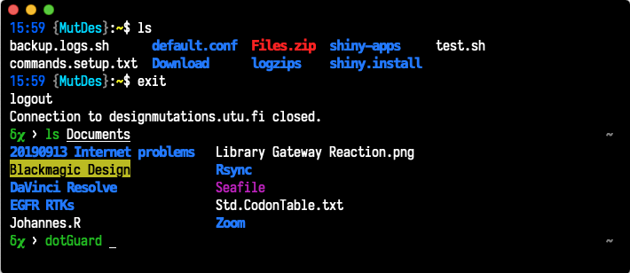

```properties
# RobocopAlpha colors
colors:   
# Default colors   
  primary:     
    background: '0x000000'     
    foreground: '0xFFFFFF' 

  normal:
    black:   '0x000000'
    red:     '0xFF2222'
    green:   '0x22BB22'
    yellow:  '0xBBBB22'
    blue:    '0x2279FF'
    magenta: '0xBB22BB'
    cyan:    '0x22BBBB'
    white:   '0xDDDDDD'
 
  # Bright colors
  bright:
    black:   '0x888888'
    red:     '0xFF2222'
    green:   '0x22FF22'
    yellow:  '0xFFFF22'
    blue:    '0x2279FF'
    magenta: '0xFF22FF'
    cyan:    '0x22FFFF'
    white:   '0xFFFFFF'

```


## [Argonaut](https://github.com/pwaleczek/Argonaut-theme)

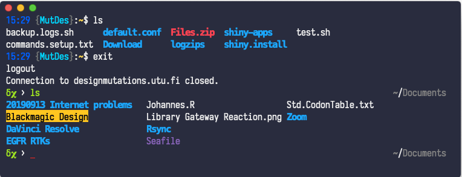

```properties
# Colors (Argonaut)
colors:
  # Default colors
  primary:
    background: '#292C3E'
    foreground: '#EBEBEB'

  # Cursor colors
  cursor:
   text: '#FF261E'
   cursor: '#FF261E'

  # Normal colors
  normal:
    black:   '#0d0d0d'
    red:     '#FF301B'
    green:   '#A0E521'
    yellow:  '#FFC620'
    blue:    '#1BA6FA'
    magenta: '#8763B8'
    cyan:    '#21DEEF'
    white:   '#EBEBEB'

  # Bright colors
  bright:
    black:   '#6D7070'
    red:     '#FF4352'
    green:   '#B8E466'
    yellow:  '#FFD750'
    blue:    '#1BA6FA'
    magenta: '#A578EA'
    cyan:    '#73FBF1'
    white:   '#FEFEF8'
```


## [Blood Moon](https://github.com/dguo/blood-moon)

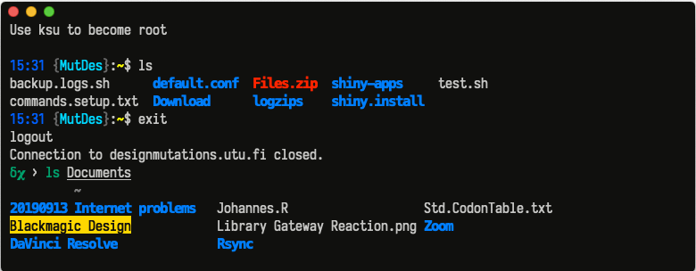

```properties
# Colors (Blood Moon)
colors:
  # Default colors
  primary:
    background: '#10100E'
    foreground: '#C6C6C4'

  # Normal colors
  normal:
    black:   '#10100E'
    red:     '#C40233'
    green:   '#009F6B'
    yellow:  '#FFD700'
    blue:    '#0087BD'
    magenta: '#9A4EAE'
    cyan:    '#20B2AA'
    white:   '#C6C6C4'

  # Bright colors
  bright:
    black:   '#696969'
    red:     '#FF2400'
    green:   '#03C03C'
    yellow:  '#FDFF00'
    blue:    '#007FFF'
    magenta: '#FF1493'
    cyan:    '#00CCCC'
    white:   '#FFFAFA'
```


## [Hyper](https://hyper.is/)

Yellow taken from Blood Moon

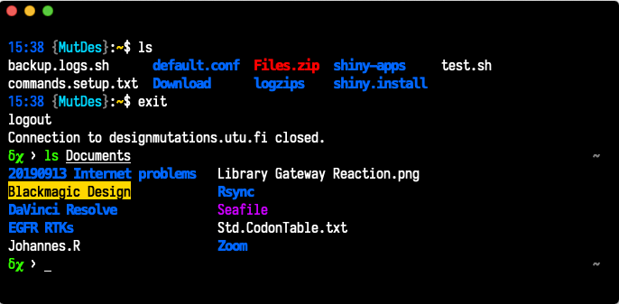

```properties
# Colors (Hyper)
colors:
  # Default colors
  primary:
    background: '#000000'
    foreground: '#ffffff'
  cursor:
    text: '#F81CE5'
    cursor: '#ffffff'

  # Normal colors
  normal:
    black:   '#000000'
    red:     '#fe0100'
    green:   '#33ff00'
    yellow:  '#FFD700'
  # yellow:  '#feff00'
    blue:    '#0066ff'
    magenta: '#cc00ff'
    cyan:    '#00ffff'
    white:   '#d0d0d0'

  # Bright colors
  bright:
    black:   '#808080'
    red:     '#fe0100'
    green:   '#33ff00'
    yellow:  '#FFD700'
    # yellow:  '#feff00'
    blue:    '#0066ff'
    magenta: '#cc00ff'
    cyan:    '#00ffff'
    white:   '#FFFFFF'
```


## Iterm Default

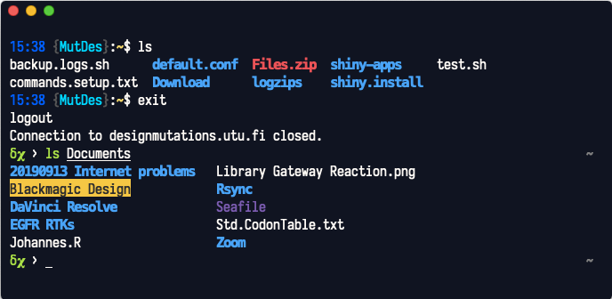

```properties
# Colors (iTerm 2 default theme)
colors:
  # Default colors
  primary:
    background: '#101421'
    foreground: '#fffbf6'

 # Normal colors
  normal:
    black:   '#2e2e2e'
    red:     '#eb4129'
    green:   '#abe047'
    yellow:  '#f6c744'
    blue:    '#47a0f3'
    magenta: '#7b5cb0'
    cyan:    '#64dbed'
    white:   '#e5e9f0'

 # Bright colors
  bright:
    black:   '#565656'
    red:     '#ec5357'
    green:   '#c0e17d'
    yellow:  '#f9da6a'
    blue:    '#49a4f8'
    magenta: '#a47de9'
    cyan:    '#99faf2'
    white:   '#ffffff'
```

## [Material Theme](https://github.com/equinusocio/material-theme)

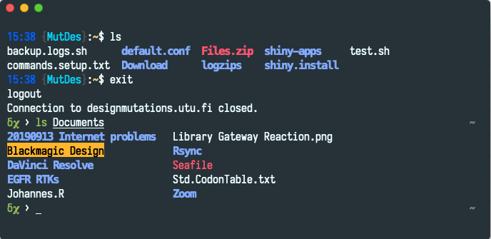

```properties
# Colors (Material Theme)
colors:
  # Default colors
  primary:
    background: '#263238'
    foreground: '#eeffff'

  # Normal colors
  normal:
    black:   '#000000' 
    red:     '#e53935'
    green:   '#91b859'
    yellow:  '#ffb62c'
    blue:    '#6182b8'
    magenta: '#ff5370'
    cyan:    '#39adb5'
    white:   '#a0a0a0' 

  # Bright colors
  bright:
    black:   '#4e4e4e' 
    red:     '#ff5370'
    green:   '#c3e88d'
    yellow:  '#ffcb6b'
    blue:    '#82aaff'
    magenta: '#f07178' 
    cyan:    '#89ddff'
    white:   '#ffffff'  
```

## Monokai Soda

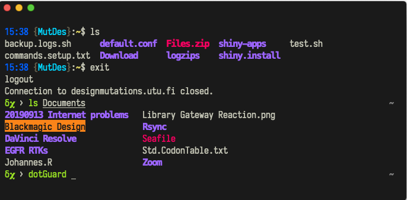

```properties
# Colors (Monokai Soda)
colors:
  # Default colors
  primary:
    background: '#1a1a1a'
    foreground: '#c4c5b5'

  # Normal colors
  normal:
    black:   '#1a1a1a'
    red:     '#f4005f'
    green:   '#98e024'
    yellow:  '#fa8419'
    blue:    '#9d65ff'
    magenta: '#f4005f'
    cyan:    '#58d1eb'
    white:   '#c4c5b5'

  # Bright colors
  bright:
    black:   '#625e4c'
    red:     '#f4005f'
    green:   '#98e024'
    yellow:  '#e0d561'
    blue:    '#9d65ff'
    magenta: '#f4005f'
    cyan:    '#58d1eb'
    white:   '#f6f6ef'
```


## Ubuntu

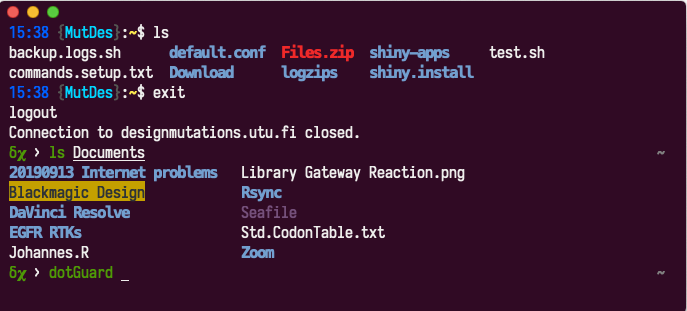

```properties
# Colors (Ubuntu)
colors:
  # Default colors
  primary:
    background: '#300a24'
    foreground: '#eeeeec'

  # Normal colors
  normal:
    black:   '#2e3436'
    red:     '#cc0000'
    green:   '#4e9a06'
    yellow:  '#c4a000'
    blue:    '#3465a4'
    magenta: '#75507b'
    cyan:    '#06989a'
    white:   '#d3d7cf'

  # Bright colors
  bright:
    black:   '#555753'
    red:     '#ef2929'
    green:   '#8ae234'
    yellow:  '#fce94f'
    blue:    '#729fcf'
    magenta: '#ad7fa8'
    cyan:    '#34e2e2'
    white:   '#eeeeec'
```

## Pop OS

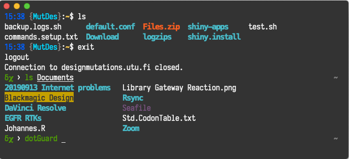

```properties
# Colors (Pop OS)
colors:
  # Default colors
  primary:
    background: '#333333'
    foreground: '#F2F2F2'

  # Normal colors
  normal:
    black:   '#333333'
    red:     '#CC0000'
    green:   '#4E9A06'
    yellow:  '#C4A000'
    blue:    '#3465A4'
    magenta: '#75507B'
    cyan:    '#06989A'
    white:   '#D3D7CF'

  # Bright colors
  bright:
    black:   '#88807C'
    red:     '#F15D22'
    green:   '#73C48F'
    yellow:  '#FFCE51'
    blue:    '#48B9C7'
    magenta: '#AD7FA8'
    cyan:    '#34E2E2'
    white:   '#EEEEEC'
```

## Spacemacs light

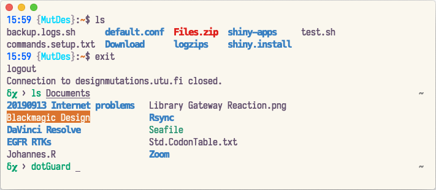

```properties
# color (Spacemacs light)
colors:
  primary:
    foreground: '#64526F'
    background: '#FAF7EE'

  cursor:
    cursor:     '#64526F'
    text:       '#FAF7EE'
  normal:
    black:      '#FAF7EE'
    red:        '#DF201C'
    green:      '#009F6B'
    # green:      '#29A0AD'
    yellow:     '#DB742E'
    blue:       '#3980C2'
    magenta:    '#2C9473'
    cyan:       '#6B3062'
    white:      '#64526F'

  bright:
    black:      '#9F93A1'
    red:        '#DF201C'
    green:      '#009F6B'
    # green:      '#29A0AD'
    yellow:     '#DB742E'
    blue:       '#3980C2'
    magenta:    '#2C9473'
    cyan:       '#6B3062'
    white:      '#64526F'
```


## [Seabird](https://github.com/nightsense/seabird)

foreground color made darker than original

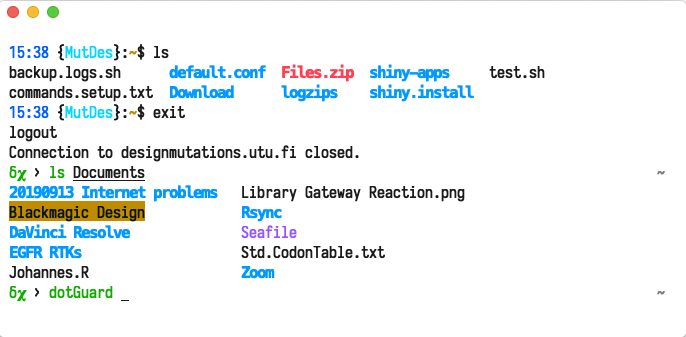

```properties
# Colors (Seabird)
colors:
  # Default colors
  primary:
    background: '#ffffff'
    # foreground: '#61707a'
    foreground: '#1A1A1A'

  # Normal colors
  normal:
    black:   '#0b141a'
    red:     '#ff4053'
    green:   '#11ab00'
    yellow:  '#bf8c00'
    blue:    '#0099ff'
    magenta: '#9854ff'
    cyan:    '#00a5ab'
    white:   '#ffffff'

  # Bright colors
  bright:
    black:   '#0b141a'
    red:     '#ff4053'
    green:   '#11ab00'
    yellow:  '#bf8c00'
    blue:    '#0099ff'
    magenta: '#9854ff'
    cyan:    '#00a5ab'
    white:   '#ffffff'
```


## Terminal app basic

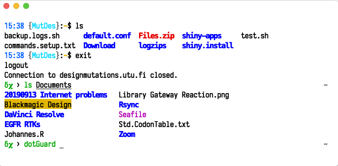

```properties
# Colors (Terminal.app Basic)
colors:
  primary:
    background: '#FFFFFF'
    foreground: '#000000'
  normal:
    black:      '#000000'
    red:        '#990000'
    green:      '#00A600'
    yellow:     '#e1b600'
    blue:       '#0000B2'
    magenta:    '#B200B2'
    cyan:       '#00A6B2'
    white:      '#BFBFBF'
  bright:
    black:      '#666666'
    red:        '#E50000'
    green:      '#00D900'
    yellow:     '#e1b600'
    blue:       '#0000FF'
    magenta:    '#E500E5'
    cyan:       '#00E5E5'
    white:      '#E5E5E5'  
```


