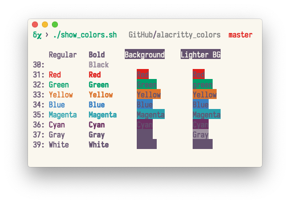

[](https://github.com/alacritty/alacritty) [](https://github.com/robocopAlpha/alacritty_colors/blob/master/LICENSE) [](https://github.com/robocopAlpha/alacritty_colors/commits/master) [](https://github.com/robocopAlpha/alacritty_colors/stargazers) [](https://github.com/robocopAlpha/alacritty_colors/issues) [](https://github.com/robocopAlpha/alacritty_colors/pulls)

# alacritty colors

This repo contains snippets for color schemes to use with [alacritty](https://github.com/alacritty/alacritty) terminal emulator (and other similar apps). Most of these themes are (as-is or modified) from [alacritty's wiki](https://github.com/alacritty/alacritty/wiki/Color-schemes).

Also includes a handy bash script [`show_colors.sh`](./show_colors.sh) to print the colors.

if you don’t want to clone this repo but still want to test the color scheme then you can run:

```sh
curl -sL 'https://raw.githubusercontent.com/robocopAlpha/alacritty_colors/master/show_colors.sh' | bash
```


**NB:** While making this repo I didn’t realize that there are repos like [eendroroy’s](https://github.com/eendroroy/alacritty-theme) where they have been putting in the effort for a long time to curate content. I will maintain this repo to archive other color schemes that I might find interesting over time and develop a way to apply color schemes from the CLI.


## robocopAlpha Colors     [YML](themes/robocopAlpha.yml)


## [Argonaut](https://github.com/pwaleczek/Argonaut-theme)      [YML](themes/argonaut.yml)


## [Blood Moon](https://github.com/dguo/blood-moon)      [YML](themes/bloodmoon.yml)


## [Hyper](https://hyper.is/)     [YML](themes/hyper.yml)

The color Yellow `#FFD700` has taken from [Blood Moon](themes/bloodmoon.yml).


## Iterm Default    [YML](themes/iterm2.yml)


## [Material Theme](https://github.com/equinusocio/material-theme)    [YML](themes/material.yml)


## Monokai Soda      [YML](themes/monokaiSoda.yml)


## Ubuntu      [YML](themes/ubuntu.yml)


## Pop OS       [YML](themes/pop_OS.yml)


## Spacemacs light     [YML](themes/spacemacsLight.yml)

Changes: green to `#009F6B` and magenta to `#29A0AD`.




## [Seabird](https://github.com/nightsense/seabird)      [YML](themes/seabird.yml)

Foreground color has been made darker `#1A1A1A` than original to improve contrast


## Terminal app basic       [YML](themes/terminalBasic.yml)


