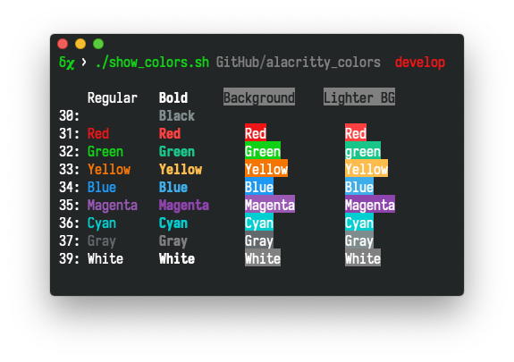
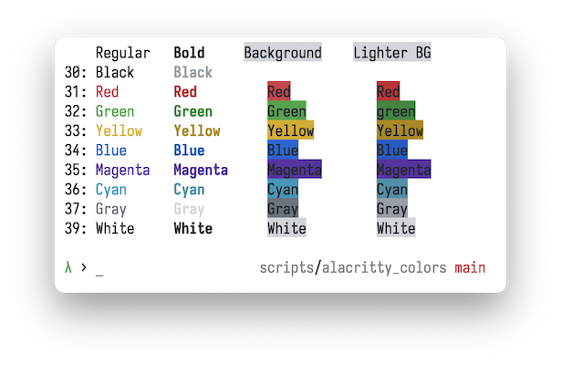
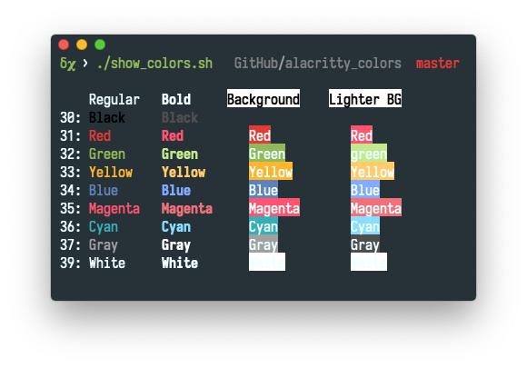
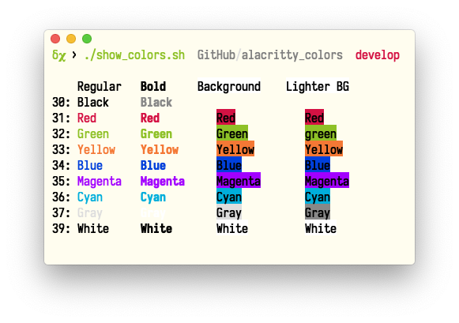
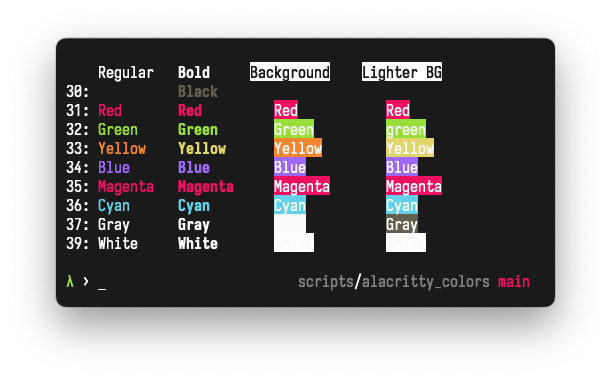
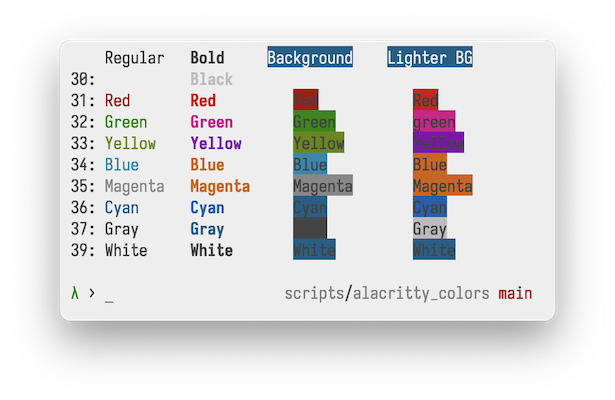
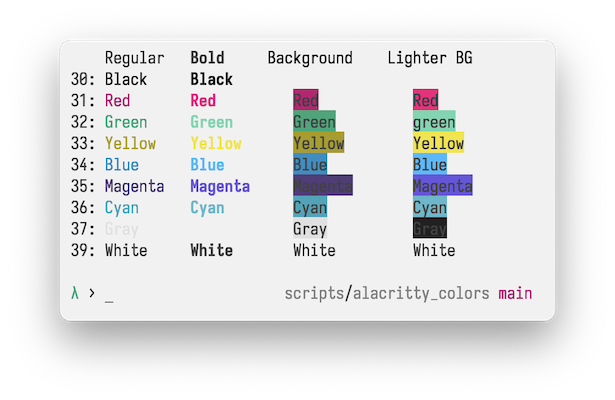
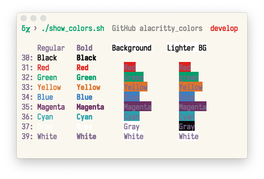

[](https://github.com/alacritty/alacritty) [](https://github.com/dchakro/alacritty_colors/blob/master/LICENSE) [](https://github.com/dchakro/alacritty_colors/commits/master) [](https://github.com/dchakro/alacritty_colors/stargazers) [](https://github.com/dchakro/alacritty_colors/issues) [](https://github.com/dchakro/alacritty_colors/pulls)

# alacritty colors

## About
This repo contains snippets for color schemes to use with [alacritty](https://github.com/alacritty/alacritty) terminal emulator (and other similar apps) and bash scripts to [apply themes](./apply_themes.sh) and [show the current theme's colors](./show_colors.sh). 

## Demo

Here is a quick demo of the process of applying themes to alacritty.


## How to use

1. Clone the repo and give execute permissions to included scripts.

	```shell
	# Latest version
	git clone --depth 1 https://github.com/dchakro/alacritty_colors.git
	
	# or clone the complete repo
	git clone https://github.com/dchakro/alacritty_colors.git
	
	cd alacritty_colors
	chmod +x show_colors.sh apply_theme.sh
	```

2. Overwrite the [base.toml](./base.toml) with your `~/.alacritty.toml`.

   ```sh
   cd /path/to/alacritty_colors
   cp ~/.alacritty.toml ./base.toml
   ```
	
3. (***Optional***) Remove the current color scheme (if any) from the file `base.toml`, so that the "**reset**" function in the included script will restore default alacritty colors. Otherwise it will restore your current color scheme. 

4. Apply/Backup/Reset themes using

   ```sh
   ./apply_theme.sh
   ```


## Info

If you want to view the colors from your current color scheme without cloning this repo, you can do so by running:

```sh
curl -sL 'https://raw.githubusercontent.com/dchakro/alacritty_colors/master/show_colors.sh' | bash
```

## Note:

+ Most of these themes are (as-is or modified) from [alacritty's wiki](https://github.com/alacritty/alacritty/wiki/Color-schemes).
+ While making this repo I didn’t realize that there are repos like [eendroroy’s](https://github.com/eendroroy/alacritty-theme) and [rajasegar's](https://github.com/rajasegar/alacritty-themes) repos where they have been putting in the effort for a long time. I will maintain this repo to archive other color schemes that I might find interesting over time.
  + Unlike their repos this repo provides open-source simple bash scripts to view the theme colors and apply the themes.

## Preview of themes

### [Argonaut](https://github.com/pwaleczek/Argonaut-theme)   |   [toml](themes/argonaut.toml)


### Ayu Mirage  |  [toml](themes/ayuMirage.toml)


### Birds of Paradise |  [toml](themes/birds_of_paradise.toml)


### [Blood Moon](https://github.com/dguo/blood-moon)   |   [toml](themes/bloodmoon.toml)

Bright yellow changed to `#FFD700`


### Breeze (KDE)  |  [toml](themes/breeze.toml)


### Breeze2   |  [toml](themes/breeze2.toml)

modified from KDE Breeze by robocopAlpha



### Darktooth  |  [toml](themes/darktooth.toml)


### Dracula  |  [toml](themes/dracula.toml)


### Github Light | [toml](themes/githubLight.toml)


### Gruvbox  |   [toml](themes/gruvbox.toml)


### [Hyper](https://hyper.is/)   |  [toml](themes/hyper.toml)

The color Yellow `#FFD700` has taken from [Blood Moon](themes/bloodmoon.toml).


### Iterm Default  |  [toml](themes/iterm2.toml)


### Kitty  |   [toml](themes/kitty.toml)


### [Material Theme](https://github.com/equinusocio/material-theme)  |  [toml](themes/material.toml)



### Metro Style   |   [toml](./themes/metrostyle.toml)



### Monokai Soda  |   [toml](themes/monokaiSoda.toml)


### Monokai Soda version 2 | [toml](themes/monokaiSoda2.toml)
Gray and white are changed from the base theme


### PaperColor Light | [toml](themes/paperColorLight.toml)



### Paraiso Dark | [toml](themes/paraisoDark.toml)


### Pencil Light | [toml](themes/pencilLight.toml)


### Pop OS   |    [toml](themes/pop_OS.toml)


### robocopAlpha Colors   |  [toml](themes/robocopAlpha.toml)


### [Seabird](https://github.com/nightsense/seabird)   |   [toml](themes/seabird.toml)

Foreground color has been made darker `#1A1A1A` than original to improve contrast


### Spacemacs light  |   [toml](themes/spacemacsLight.toml)

Changes: green to `#009F6B` and magenta to `#29A0AD`.


### Spacer by robocopAlpha   |   [toml](./themes/spacer.toml)

Tried to map colors from the Spacemacs Light theme to ones “similar” to the names of the colors.



### Tender   |  [toml](themes/tender.toml)
Converted to TOML from:


### Terminal app basic    |   [toml](themes/terminalBasic.toml)


### Ubuntu   |    [toml](themes/ubuntu.toml)


